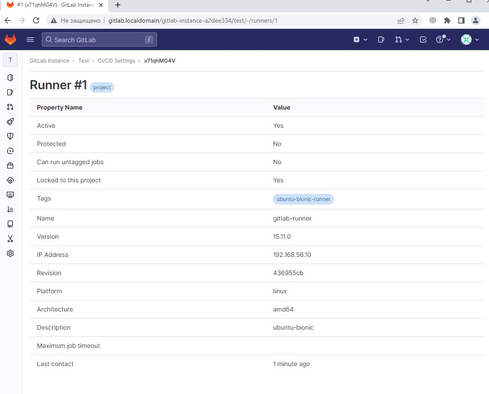

# CI/CD Gitlab
## Домашнее задание. Горбунов Владимир

## Содержание

- [Задание 1. Gitlab на локальном сервере](#Задание-1)
- [Задание 2. Настройка пайплайна в Gitlab](#Задание-2-3)  

## Задание 1

>Разверните GitLab локально, используя Vagrantfile и инструкцию, описанные в этом репозитории.</br>
Создайте новый проект и пустой репозиторий в нём.</br>
Зарегистрируйте gitlab-runner для этого проекта и запустите его в режиме Docker. Раннер можно регистрировать и запускать на той же виртуальной машине, на  которой запущен GitLab.</br>
В качестве ответа в репозиторий шаблона с решением добавьте скриншоты с настройками раннера в проекте.

- Gitlab устанавливается на локальной машине с помощью Vagrant.
- Используется образ ubuntu/bionic64 18.04
- На машине устанавливается Docker, необходимые программы для гитлаба openssh-server ca-certificates tzdata perl
- Гитлаб устанавливается с переменной с адресом по которому будет доступен gitlab
- Gitlab runner и Sonar запускаются в контейнерах Docker. 
```
sudo EXTERNAL_URL="http://gitlab.localdomain" apt-get install gitlab-ee
```
[vagrantfile](./vagrantfile)

- Получение первичного пароля:
>sudo cat /etc/gitlab/initial_root_password

- Регистрация раннера:
```bash
   docker run -ti --rm --name gitlab-runner \
     --network host \
     -v /srv/gitlab-runner/config:/etc/gitlab-runner \
     -v /var/run/docker.sock:/var/run/docker.sock \
     gitlab/gitlab-runner:latest register
```

- Конфигурация раннера для docker-in-docker:
```yaml
    volumes = ["/cache", "/var/run/docker.sock:/var/run/docker.sock"]
    extra_hosts = ["gitlab.localdomain:192.168.56.10"]
```

- Запуск:
```bash
   docker run -d --name gitlab-runner --restart always \
     --network host \
     -v /srv/gitlab-runner/config:/etc/gitlab-runner \
     -v /var/run/docker.sock:/var/run/docker.sock \
     gitlab/gitlab-runner:latest
```

- Запуск Sonarqube:
>docker-compose up -d

[docker-compose.yaml](./docker-compose.yaml)

- Скриншот зарегистрированного раннера:
`

## Задание 2-3

>Запушьте репозиторий на GitLab, изменив origin. Это изучалось на занятии по Git.</br>
Создайте .gitlab-ci.yml, описав в нём все необходимые, на ваш взгляд, этапы.</br>
В качестве ответа в шаблон с решением добавьте:</br>
файл gitlab-ci.yml для своего проекта или вставьте код в соответствующее поле в шаблоне;</br>
скриншоты с успешно собранными сборками.</br>
Измените CI так, чтобы:</br>
этап сборки запускался сразу, не дожидаясь результатов тестов; </br>
тесты запускались только при изменении файлов с расширением *.go. </br>

Чтобы билд запускался не дожидаясь теста, в билде указал:
```
  dependencies: []
```
Тест запускается только при изменении файлов *.go:
```
  only:
   changes:
     - '*.go'
```

```
stages:
  - test
  - build
  - analysis

test:
  stage: test
  image: golang:1.17
  script: 
   - go test .
  only:
   changes:
     - '*.go'
     
analysis:
  stage: test
  image:
    name: sonarsource/sonar-scanner-cli
    entrypoint: [""]
  variables:
  script:
  - sonar-scanner -Dsonar.projectKey=gitlab -Dsonar.sources=. -Dsonar.host.url=http://gitlab.localdomain:9000 -Dsonar.login=sqa_4508113f8a900343ddc6fa99d02dc81282d4bd05
 

build:
  stage: build
  image: golang:1.17
  script:
   - go build -a -installsuffix nocgo -o goapp .
  dependencies: []
```

https://github.com/Night-N/7-gitlab/blob/master/img/gitlab-ci.yml

`